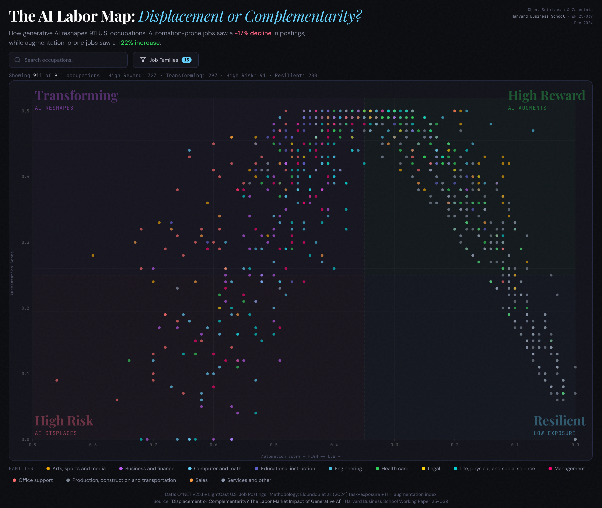

# AI Impact on Jobs: Interactive Scatter Plot

An interactive visualization of 911 U.S. occupations plotted by their **automation risk** and **augmentation potential** from generative AI.

**[View the live visualization](https://alxrmmv.github.io/jobs-graph/)**

 

## What the graph shows

Each dot represents a U.S. occupation, positioned on two axes:

- **X-axis (Automation score)** — How much of the job's tasks can be replaced by AI. High automation is on the **left**, low automation on the **right**.
- **Y-axis (Augmentation score)** — How much AI can enhance (but not replace) the job's tasks. High augmentation is at the **top**.

The plot is divided into four quadrants:

| Quadrant | Location | Meaning |
|---|---|---|
| **High Reward** | Upper-right | Low automation + high augmentation. These jobs benefit most from AI — workers become more productive without being displaced. |
| **High Risk** | Bottom-left | High automation + low augmentation. These jobs face the greatest threat — tasks can be automated with little complementary benefit. |
| **Transforming** | Upper-left | High automation + high augmentation. AI is reshaping these roles significantly — both replacing and enhancing different parts of the work. |
| **Resilient** | Bottom-right | Low automation + low augmentation. These jobs are largely unaffected by current AI capabilities. |

## Key findings from the study

The underlying research found that after the release of ChatGPT:

- Job postings for **automation-prone** occupations decreased by **17%**
- Job postings for **augmentation-prone** occupations increased by **22%**

This suggests AI is simultaneously displacing some jobs while creating demand for others.

## How to use

- **Filter by job family** — Use the dropdown in the top-right to show/hide occupations by category (e.g., Health care, Engineering, Legal).
- **Search for a job** — Type an occupation name in the search bar. A dropdown will appear with matching results. Click a result (or use arrow keys + Enter) to select it. The selected occupation will be highlighted on the graph with a label.
- **Hover** — Mouse over any dot to see the occupation name, automation score, augmentation score, and job family.
- **Clear selection** — Click the × button in the search bar or press Escape.

## Data source

Based on the Harvard Business School Working Paper 25-039:

> **"Displacement or Complementarity? The Labor Market Impact of Generative AI"**
> Chen, Srinivasan & Zakerinia (2024)

- **Automation scores**: Task-exposure model from Eloundou et al. (2024)
- **Augmentation scores**: HHI-based complementarity index
- **Occupation data**: O*NET v25.1 + LightCast U.S. Job Postings

[Read the HBR summary](https://hbr.org/2026/03/research-how-ai-is-changing-the-labor-market)
